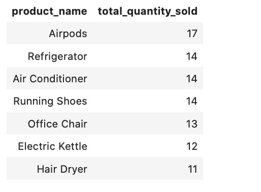
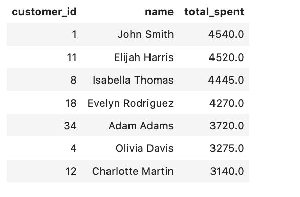
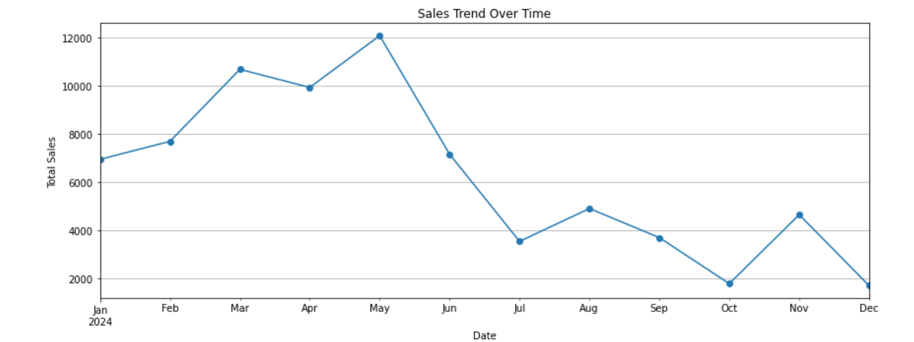
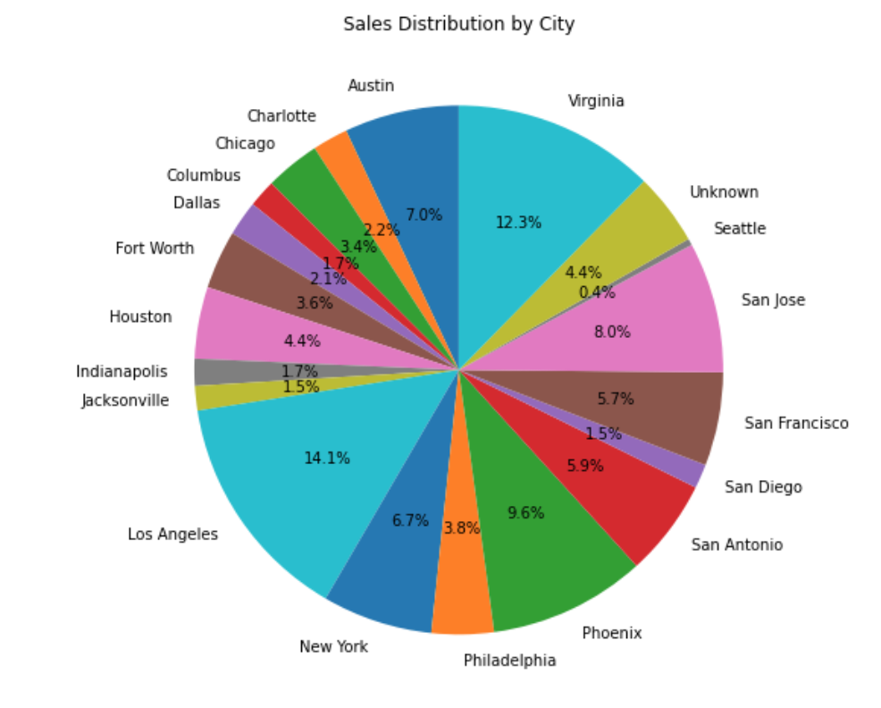
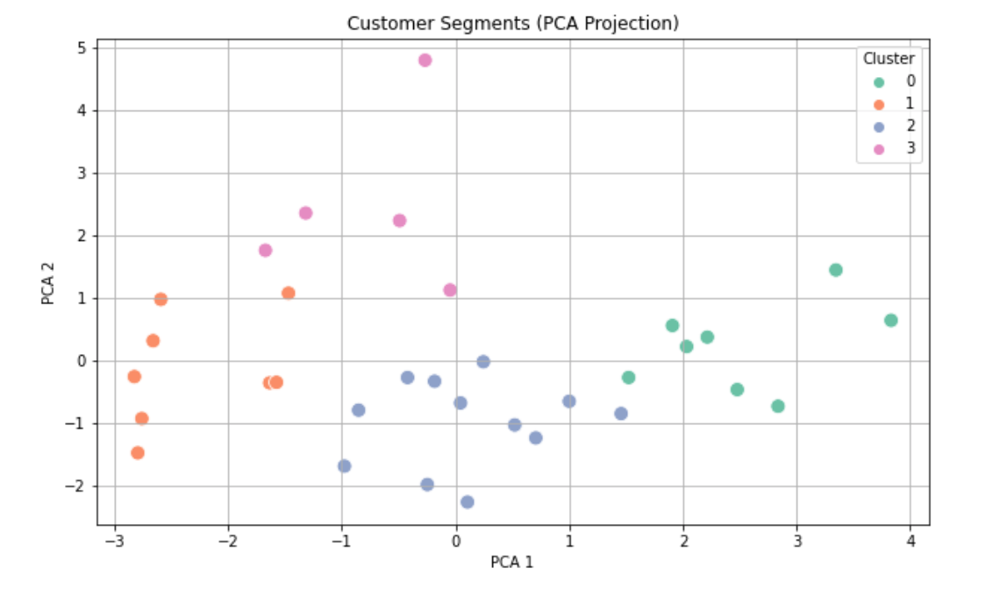
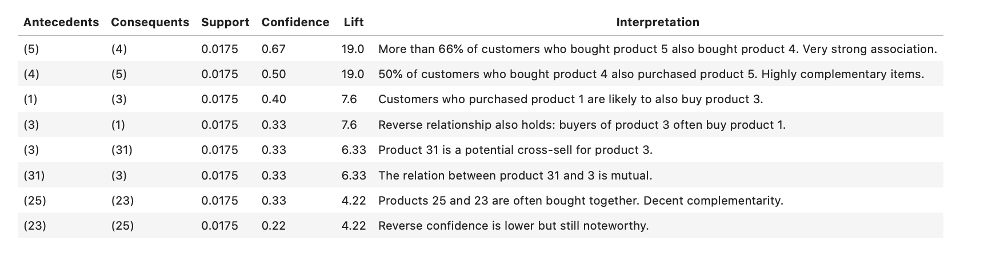

# Sales Data Analysis Project

This project presents an end-to-end workflow for analyzing sales data using SQL and Python, including database design, preprocessing, exploratory data analysis, and advanced analytical insights.

---

## 🗂 Project Structure

| Notebook Filename | Description |
|-------------------|-------------|
| `Sales-DB&Preprocessing.ipynb` | Creating and populating the SQLite database with realistic sales data |
| `Sales-BasicAnalysis.ipynb` | SQL-based exploratory analysis using aggregation, grouping, filtering, etc. |
| `Sales-AdvancedAnalysis.ipynb` | Advanced analysis and visualizations using pandas and matplotlib |

---

## 1️⃣ Database Schema

In `Sales-DB&Preprocessing.ipynb`, we created a relational SQLite database from scratch.

### Tables

- `customers`  
  - `customer_id` (Primary Key)  
  - `name`
  - `age`
  - `location`

- `products`  
  - `product_id` (Primary Key)  
  - `product_name`  
  - `category`  
  - `price`

- `orders`  
  - `order_id` (Primary Key)  
  - `customer_id` (Foreign Key)  
  - `order_date`

- `order_details`  
  - `order_id` (Foreign Key)  
  - `product_id` (Foreign Key)  
  - `quantity`

### Example Entry (customers)

| customer_id | name         | age | location   |
|-------------|--------------|-----|------------|
| 1           | John Smith   |  28 | New York   |
| 2           | Emma Johnson |  34 |Los Angeles |


---

## 2️⃣ SQL-Based Analysis

Notebook: `Sales-BasicAnalysis.ipynb`

We performed the following types of queries using raw SQL on the created database:

### 🔹 Sample Queries


## What are the most sold products?

```sql
SELECT p.name AS product_name,
       SUM(od.quantity) AS total_sold
FROM products p
JOIN order_details od ON p.product_id = od.product_id
GROUP BY p.name
ORDER BY total_sold DESC;
```


## What are the top customers by total spending?

```sql
SELECT c.name AS customer_name,
       SUM(od.quantity * od.unit_price) AS total_spent
FROM customers c
JOIN orders o ON c.customer_id = o.customer_id
JOIN order_details od ON o.order_id = od.order_id
GROUP BY c.name
ORDER BY total_spent DESC;
```


---

## 3️⃣ Advanced Analysis & Visualizations

Notebook: `Sales-AdvancedAnalysis.ipynb`

We used **pandas** for further data wrangling and **matplotlib**/**seaborn** for visualizations.

### 📌 Sample Analysis

- **Monthly sales trend**
- **Top selling product categories**
- **Correlation between quantity and revenue**
- **Most active customers**
- **Seasonal fluctuations in order volume**
- **Clustering Customers Based on Purchase Behavior**
- **Basket Recommendation and Association Rule Interpretations using Apriori Algorithm**

### 📈 Example Plot: Sales over time (monthly)

```python

full_data['order_date'] = pd.to_datetime(full_data['order_date'])
sales_over_time = full_data.groupby(full_data['order_date'].dt.to_period('M'))['total_price'].sum()
sales_over_time.index = sales_over_time.index.to_timestamp()

plt.figure(figsize=(12, 5))
sales_over_time.plot(marker='o', linestyle='-')
plt.title('Sales Trend Over Time')
plt.xlabel('Date')
plt.ylabel('Total Sales')
plt.grid(True)
plt.tight_layout()
plt.show()
```



### City Sales

```python
city_sales = full_data.groupby('city')['total_price'].sum()

plt.figure(figsize=(8, 8))
plt.pie(city_sales, labels=city_sales.index, autopct='%1.1f%%', startangle=90)
plt.title('Sales Distribution by City')
plt.show()
```



### Clustering Customers using PCA:




Cluster 0: High-Spending Loyalists
Cluster 1: Occasional Shoppers
Cluster 2: Active and Diverse Buyers
Cluster 3: Low Engagement Customers

### Basket Recommendation using Apriori Algorithm

#### Key Discovered patterns:


---

## 🧩 Tools & Libraries

- SQLite3
- Python 3.x
- Pandas
- Matplotlib
- Seaborn
- Jupyter Notebook
- Scikit-learn
- ipython-sql
- mlxtend

---

## 📫 Contact

For questions or collaborations:

**Sogol Sondossi**  
📧 sogol.sondossi96@gmail.com  
📍 Currently open to data-related roles and internships

---

